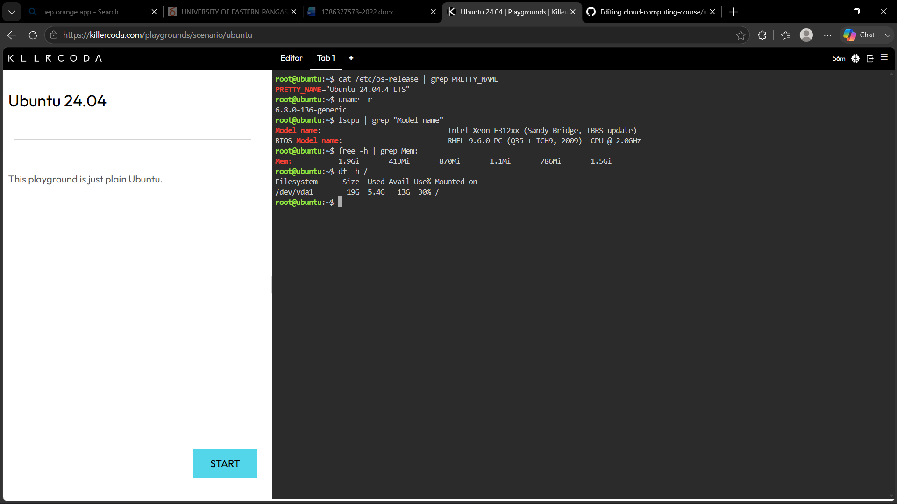
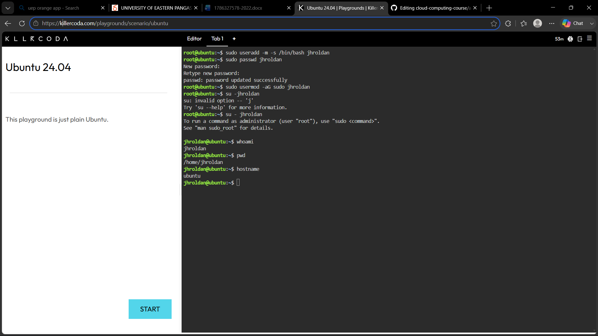
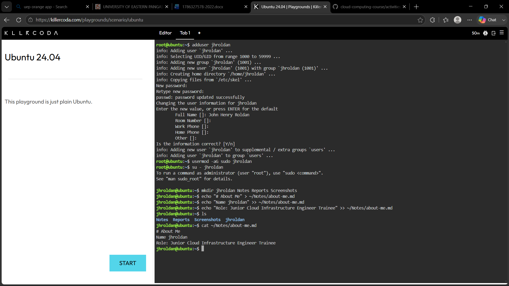
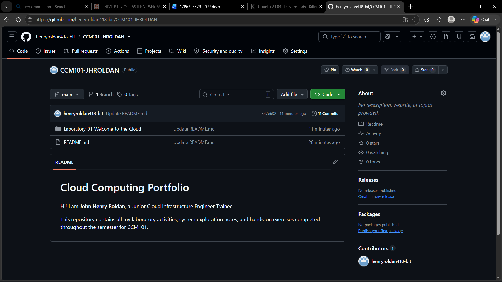
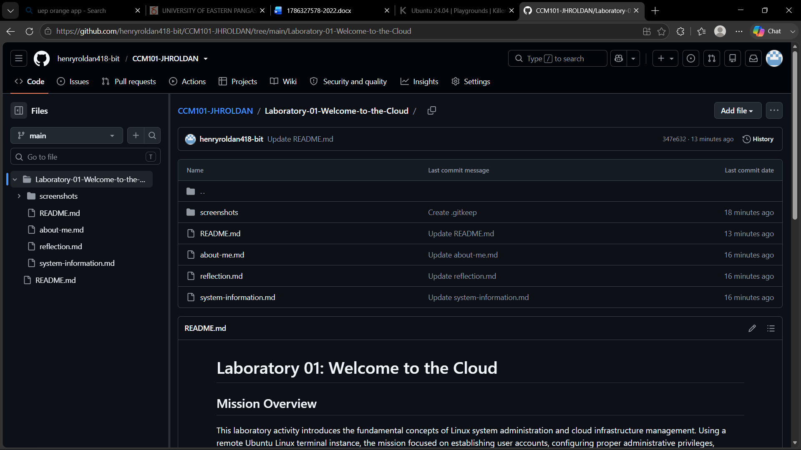

# Laboratory 01: Welcome to the Cloud

## Mission Overview
This laboratory activity introduces the fundamental concepts of Linux system administration and cloud infrastructure management. Using a remote Ubuntu Linux terminal instance, the mission focused on establishing user accounts, configuring proper administrative privileges, structuring a project workspace, and verifying terminal setups for deployment.

## Objectives
* Initialize and configure a remote Ubuntu 24.04 LTS cloud terminal environment.
* Practice user management by creating non-root accounts and delegating administrative permissions.
* Construct an organized directory hierarchy and manage structured Markdown files.
* Establish version control workflows by documenting hands-on execution inside a public GitHub repository.

## Activities Performed
1. **Identity & Setup:** Provisioned the primary user account `jhroldan` on Ubuntu 24.04 LTS and granted `sudo` administrative rights.
2. **Environment Exploration:** Switched from `root` to the standard user environment (`su - jhroldan`) to enforce security best practices.
3. **Workspace Construction:** Created core directory structures (`jhroldan`, `Notes`, `Reports`, `Screenshots`) and initialized `Notes/about-me.md` containing engineer profile details.
4. **Portfolio Integration:** Documented commands and terminal evidence directly into the public `CCM101-JHROLDAN` GitHub portfolio.

## Linux Commands Used
* `adduser` – Created the primary non-root user account `jhroldan`.
* `usermod -aG sudo` – Added the user account to the `sudo` group for administrative privileges.
* `su - jhroldan` – Switched active user sessions to ensure commands run under the correct user environment.
* `mkdir` – Created the required workspace directory tree (`jhroldan`, `Notes`, `Reports`, `Screenshots`).
* `echo` – Wrote and appended text content into `Notes/about-me.md`.
* `cat` – Displayed and verified file contents directly in the terminal output.
* `ls` – Checked and listed directory structure contents.

## Skills Learned
* **Access Control & User Security:** Learned the importance of operating under a standard non-root user account to prevent unintended system changes.
* **Linux File System Management:** Acquired hands-on experience navigating paths, creating directory hierarchies, and managing files via CLI.
* **Troubleshooting & Command Syntax:** Developed troubleshooting skills regarding pathing, case sensitivity, and file creation dependencies in Bash.
* **Technical Documentation:** Mastered tracking live technical tasks and embedding terminal evidence into Markdown portfolios.

## Terminal & Workspace Evidence

### 1. KillerCoda Playground Environment

### 2. Terminal Session (jhroldan User)

### 3. Created Directory Structure

### 4. GitHub Repository Homepage

### 5. Repository File Structure
  
